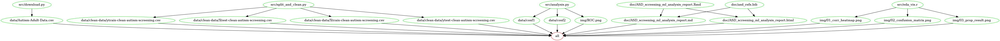

# An Autism Spectrum Disorder Screening Machine Learning Analysis
##### *522 Workflows: Group \#414*
Members: Tejas Phaterpekar, Matthew Connell, Thomas Pin

## About

Here we trained several machine learning models from the sklearn package in the Python programming language in attempt to find a model that would better and more quickly diagnose autism in adults. We used survey data from the UCI Machine Learning Datasets repository.

The survey data we used consisted of ten questions in addition to other information about the respondent, such as age and country of residence. We looked into whether there were questions that could be disregarded from the survey without having a negative impact on the accuracy of diagnosis.

We eventually chose a Decision Tree Classifier as our model. However, even though we had decent results on training and validation data, our model was poor at predicting outcomes on our test data.

The dataset used in this analysis was obtained from the University of California Irvine Machine learning Repository, uploaded by Fadi Thabtah. Each row represents an individual who participated in the survey. The survey’s results, the app’s classification, and some background information about the indvidual was recorded.

## Report

The final report can be found [here](https://ubc-mds.github.io/522-Workflows-Group-414/doc/ASD_screening_ml_analysis_report.html)

## Usage

### Docker

To replicate this analysis, clone this github repository, make sure you have Docker installed, use the command line to navigate to the root directory of the project directory and type in:


```
docker run --rm -v <PATH_ON_YOUR_COMPUTER>:/522-Workflows-Group-414 mattc514/522-workflows:v1 make -C /522-Workflows-Group-414 all
```

where `<PATH_ON_YOUR_COMPUTER>` is the absolute path to the project directory.


To reset the repo to a clean state, with no intermediate or result files, run the follow command in the terminal from the root directory of this project repository 


```
docker run --rm -v <PATH_ON_YOUR_COMPUTER>:/522-Workflows-Group-414 mattc514/522-workflows:v1 make -C /522-Workflows-Group-414 clean
```

where `<PATH_ON_YOUR_COMPUTER>` is the absolute path to the project directory.

### Make

Alternatively, if you do not wish to use Docker, you can replicate this analysis using `Make`. First, clone this github repository. Next, ensure you have the following dependencies installed:

**R packages**:
- tidyverse==1.2.1 
- reshape2==1.4.3
- docopt==0.6.1
- caret==6.0.84
- testthat==2.2.1

**Python packages**:
- docopt==0.6.2
- zipfile==3.2
- pandas==0.25.3
- urllib==0.21.5
- requests==2.22.0
- sklearn==0.22.1
- numpy==1.17.4
- scipy==1.3.1
- altair==3.2.0

Then use the command line to navigate to the root directory of the project directory and type in:

```
make all 
```

Finally, to reset the repo to a clean state, with no intermediate or result files, run the follow command in the terminal from the root directory of this project repository:

```
make clean
```

## Makefile2graph

Graphical representation of file structure:



Direct [link](https://github.com/UBC-MDS/522-Workflows-Group-414/blob/589582a79604415f45e603544ad9402ab843d35e/img/Makefile.png)


## License

The Autism Spectrum Disorder Screening Machine Learning Analysis materials here are licensed under the Creative Commons Attribution 2.5 Canada License (CC BY 2.5 CA). If re-using/re-mixing please provide attribution and link to this webpage.

## References: 

1. Thabtah, F. 2018. "An accessible and efficient autism screening method for behavioural data and predictive analyses". 25(4):1739-1755. Health Informatics Journal.[https://doi.org/10.1177/1460458218796636](https://journals.sagepub.com/doi/full/10.1177/1460458218796636?url_ver=Z39.88-2003&rfr_id=ori%3Arid%3Acrossref.org&rfr_dat=cr_pub%3Dpubmed)

2. Allison, C., Auyeung, B., and Baron-Cohen, S. 2012. "Toward brief 'Red Flags' for autism screening: The Short Autism Spectrum Quotient and the Short Quantitative Checklist for Autism in toddlers in 1,000 cases and 3,000 controls". 51(2):202-212. J Am Acad Child Adolesc Psychiatry.[https://doi.org/10.1016/j.jaac.2011.11.003](https://www-sciencedirect-com.proxy.lib.sfu.ca/science/article/pii/S0890856711010331#!)

3. [Autism Spectrum Quotient-10 Survey (AQ-10)](https://www.nice.org.uk/guidance/cg142/resources/autism-spectrum-quotient-aq10-test-pdf-186582493).

4. [UCI Dataset Respository](https://archive.ics.uci.edu/ml/datasets/Autism+Screening+Adult).

5. Dua, Dheeru, and Casey Graff. 2017. “UCI Machine Learning Repository.” University of California, Irvine, School of Information; Computer Sciences.[http://archive.ics.uci.edu/ml/index.php](http://archive.ics.uci.edu/ml).
