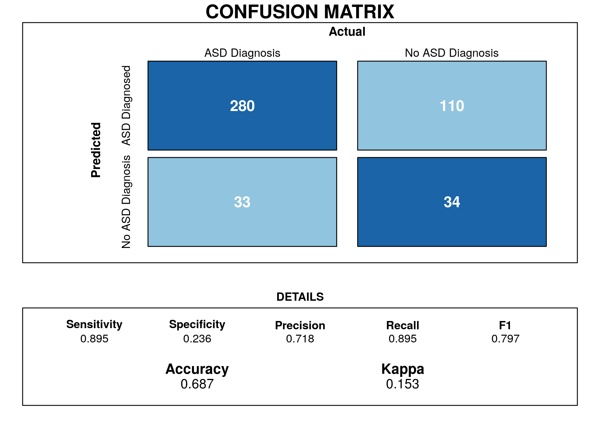
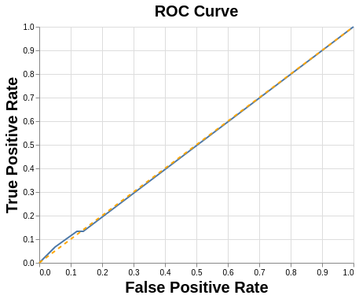

```{r setup, include=FALSE}
knitr::opts_chunk$set(echo = TRUE)
library(knitr)
library(tidyverse)
```

# Summary

Here we trained several machine learning models from the `sklearn` package in the Python programming language in attempt to find a model that would better and more quickly diagnose autism in adults. We used survey data from the [UCI Machine Learning Datasets](https://archive.ics.uci.edu/ml/datasets/Autism+Screening+Adult) repository.

The survey data we used consisted of ten questions in addition to other information about the respondent, such as age and country of residence. We looked into whether there were questions that could be disregarded from the survey without having a negative impact on the accuracy of diagnosis.

We eventually chose a Decision Tree Classifier as our model. However, even though we had decent results on training and validation data, our model was poor at predicting outcomes on our test data. 

# Introduction

Autism Spectrum Disorder (ASD) is a complex neurodevelopmental condition that impairs social interpretation/communication ability, as well as the presence of repetitive behaviors. Current diagnostic procedures are lengthy and inefficient [@Fadi]. Affecting 1.5% of the population, with many more cases going undetected, an easy-to-implement, effective screening method is warranted. ASDTest, a mobile app, has been introduced to provide an accessible screening method that tells the user whether they should seek professional healthcare opinions, based on a 10 question survey [@allison2012toward]. The ability to recognize and diagnose ASD at an early age can allow the affected to access the healthcare resources and support they will need, in a timely manner. 

The Autism Spectrum Quotient-10 ([AQ-10](https://www.nice.org.uk/guidance/cg142/resources/autism-spectrum-quotient-aq10-test-pdf-186582493)) consists of 10 questions intended to differentiate characteristics of autism in individuals. Each question has four possible answers: "Definitely Agree", "Slightly Agree, "Slightly Disagree", and "Definitely Disagree". For questions 1, 5, 7, and 10, a value of 1 is assigned for either a "slightly agree" or a "definitely agree" response. For questions 2, 3, 4, 6, 8, and 9, a value of 1 is assigned for either a "slightly disagree" or a "definitely. disagree" response. A cumulative score is calculated and a participant who receives a total score of greater than 6 is recommended for a specialist diagnostic assessment.

Using this metric on the dataset, the ASDTest app has the following performance.

```{r plot 1, echo=FALSE, fig.cap="Figure 1. Confusion Matrix between the true ASD Diagnoses and the result of the AQ-10 results", out.width = "70%", out.height= "70%"}


```

The confusion matrix in Figure 1 will act as a baseline for how our model compares to the AQ-10 predictions.  The AQ-10 has high false positive rate of 110 cases which is an issue because it will push more participants to contact a healthcare professional and put more stress on the healthcare system as a whole. Additionally, the current AQ-10 has a high recall (0.895) with only 33 false negative cases. This is a positive sign because as a screening test they do not want to miss out on potential patients.  

Currently, all 10 prompts in the survey have equal importance in the app’s classification process which had a recall of 0.895 on the adult data. **Using the same data, are we able to create a model that is able to increase the recall score, relative to the ASDTest app?**

# Methods

## Data

The [dataset<sup>4</sup>](https://archive.ics.uci.edu/ml/datasets/Autism+Screening+Adult)  used in this analysis was obtained from the University of California Irvine Machine learning Repository, uploaded by Fadi Thabtah. Each row represents an individual who participated in the survey. The survey's results, the app's classification, and some background information about the individual was recorded. Below is the entire variable set:

```{r, echo = FALSE, warning = FALSE, message = FALSE}
library(kableExtra)
object <- {
  "| Variable             | Type             | Description                                                                                                                            |
|----------------------|------------------|----------------------------------------------------------------------------------------------------------------------------------------|
| A1_score             | Int (0,1)        | Prompt: I often notice small sounds when others do not                                                                                 |
| A2_score             | Int (0,1)        | Prompt: I usually concentrate more on the whole picture, rather than the small details                                                 |
| A3_score             | Int (0,1)        | Prompt: I find it easy to do more than one thing at once                                                                               |
| A4_score             | Int (0,1)        | Prompt: If there is an interruption, I can switch back to what I was doing very quickly                                                |
| A5_score             | Int (0,1)        | Prompt: I find it easy to 'read between the lines' when someone is talking to me                                                       |
| A6_score             | Int (0,1)        | Prompt: I know how to tell if someone listening to me is getting bored                                                                 |
| A7_score             | Int (0,1)        | Prompt: When I'm reading a story I find it difficult to work out the characters' intentions                                            |
| A8_score             | Int (0,1)        | Prompt: I like to collect information about categories of things(e.g. types of car, types of bird, types of train, types of plant etc) |
| A9_score             | Int (0,1)        | Prompt: I find it easy to work out what someone is thinking or feeling just by looking at their face                                   |
| A10_score            | Int (0,1)        | Prompt: I find it difficult to work out people's intentions                                                                            |
| Age                  | Int              | Age of the individual                                                                                                                  |
| Gender               | String           | M (male) or F (female)                                                                                                                 |
| Ethnicity            | String           | Common Ethnicities defined for each individual                                                                                         |
| Born with Jaundice?  | String (yes,no)  | Was individual born with jaundice?                                                                                                     |
| Country of Residence | String           | Home country of individual                                                                                                             |
| Used app before?     | String (yes, no) | Has the user has used a screening app                                                                                                  |
| Result               | Int              | Cumulative score of the 10 survey Q's                                                                                                  |
| age_desc             | String           | Age Group                                                                                                                              |
| relation             | String           | Parent, self, caregiver, medical staff, clinician ,etc.                                                                                |
| ASD/Class            | String (yes, no) | App's classification based on result                                                                                                   |
| autism (Target Variable)  | String (yes, no) | Does individual have an autism diagnosis?  
"
}
data_frame <- read_delim(object, delim = '|')
data_frame <- data_frame %>% select(-X5, -X1) %>% slice(-1)
knitr::kable(data_frame) %>% kable_styling(bootstrap_options = "condensed", full_width = F, fixed_thead = TRUE)
```

## Analysis

To start, we explored the correlational relationships between the different AQ-10 survey questions.

```{r plot 2, echo=FALSE, fig.cap="Figure 2. Correlation heatmap of between questions on the AQ_10", out.width = "70%", out.height= "70%"}
knitr::include_graphics("../img/01_corr_heatmap.png")
```

In Figure 2, a maximum Pearson correlation was 0.6, between AQ-4 and AQ-9. In general, very low correlational values were observed. Therefore, the AQ-10 test is a valid test with a low chance that a combination of questions will swing the results. 

Next, we explored how the cumulative score of the survey(`result`) related to an autism diagnosis.

```{r plot 3, echo=FALSE, fig.cap="Figure 3. Proportion of true diagnosis and their final score on the AQ-10", out.width = "70%", out.height= "70%"}
knitr::include_graphics("../img/03_prop_result.png")
```


The app was designed so that a result of 6 or greater resulted in a recommendation for a specialist opinion. Figure 3 depicts the proportion of true diagnosis and their score out of 10 on the AQ-10. Results below or equal to 6 were associated with lower proportions of autism diagnosis, compared to the higher proportions associated with results greater than 6. Furthermore, if someone scored a 0 then they didn’t have a true diagnosis of ASD which is an appropriate result for a screening test. The only issue is the 15% of people who scored 1 on their AQ-10 but had a true diagnose of ASD. Overall, these observations show that the survey does show some effectiveness in classifying autism, although this classification isn't flawless. 


### Choosing a model

For the analysis, the training data was split into a train set and a validation set. Using these sets of data, we conducted a grid search with cross validation over five different type of models (Logistic Regression, K-Nearest Neighbors, Random Forest Classifier, Decision Tree Classifier, and Support Vector Machine classification). We used `recall` as the scoring method as our goal was not to get the most accurate model, but to get the model that reduced the number of false negatives. Additionally, there was the issue of class imbalance as our dataset consisted mostly of people who were not diagnosed with Autism. Merely choosing accuracy as our goal would have made the model predict only negative outcomes. 

The model with the best recall was found to be a `Decision Tree Classifier` with parameters `max_depth` equal to 20 and `max_features` equal to 50. The confusion matrix on the validation set for this model is below. 

```{r conf1, echo=FALSE, fig.cap="Figure 4. Confusion Matrix for a Decision Tree Classifier"}
# knitr::include_graphics("../img/all-features-classification-report.png")

conf1<-read.csv("../data/conf1")
names(conf1) <- c("", "Predicted no autism", "Predicted autism")

kable(conf1, align="c", 
      caption = "Preliminary Confusion Matrix",
      format="markdown")
```

```{r recall_score1, echo=FALSE}
TP <- conf1[2,3]
FN <- conf1[2,2]
```

The recall score is `r TP/(TP+FN)`.

### Improving the model

One of the goals of this project was to find which questions on the survey would best predict the diagnosis of Autism and whether or not any of the questions from the survey could be dropped without reducing accuracy. This would help streamline the diagnosis process and save time for everyone.

#### Forward Selection

An attempt at choosing the best questions was made using the feature selection concept of `forward selection`, where a model chooses the feature that best predicts the validation set, and then the next best feature is chosen. However, it was determined that no one question was better than another at predicting the outcomes, so `forward selection` was not useful. 

#### Recursive Feature Elimination

We tried another method of feature selection called `recursive feature elimination`, which looks at all features and then eliminates the one that is the least helpful in predicting the target features. This is done until the desired number of features is selected. 

The 'best' questions found by `RFE` were questions 4, 5, 6, 8, and 10.

However, when fitting a new `Decision Tree Classifier` with only these features, the recall score got worse on both the training set and the validation set.  

Similarly, choosing all the questions as features and no other features yielded worse results than our initial model.


# Final Results/Discussion

After selecting a model with grid search cross-validation and deciding to use all the features of the dataset, we used our Decision Tree model to predict results on our test set. Unfortunately, the recall score was far below that of our validation set. 

Confusion matrix of final model on test set:

```{r plot 7, echo=FALSE, fig.cap="Figure 7. Confusion Matrix for a Decision Tree Classifier, using all  features", out.width = "70%", out.height= "70%"}
# knitr::include_graphics("../img/all-features-testset-classification-report.png")

conf2<-read.csv("../data/conf2")
names(conf2) <- c("", "Predicted no autism", "Predicted autism")

kable(conf2, align="c", 
      caption = "Final Confusion Matrix",
      format="markdown")

```


```{r recall_score2, echo=FALSE}
TP <- conf2[2,3]
FN <- conf2[2,2]

```

The final recall score is `r TP/(TP+FN)`.


ROC curve:

```{r plot 8, echo=FALSE,  fig.cap="Figure 8. Decision Tree Classifier ROC Curve", out.width = '50%', out.height= '50%'}

```


# Limitations/Assumptions

There were 131 rows that contained "?" or "other" values in the "country_of_res", "relation", and "age" columns. It is possible that "?" values resulted in participants not filling in aspects of the survey. We were unable to easily fill these values without feeling like we would bias our results. Instead, we opted to remove these rows entirely and only use the remaining data. This limits our study because we did lose (18%) of the original data that could have had a potential influence on our model.  

Our original intention was to use survey data from children, adolescents, and adults. However, we were unable to access the survey questions used for the Child-AQ-10 and Adolescent-AQ-10, which are different to the Adult-AQ-10 question. As a result, we were limited to addressing questions that focused on solely on adults.

Additionally, our model was struggling due the structure of the data that we were given. Our model was struggling to find the nuance in the AQ-10 questions because they have been filtered down to a 0 or 1. We would prefer to have the original results of “definitely disagree” to “definitely agree”. This would give our models more freedom of expression than forcing it to look at a binary result. 

# Future Considerations

In future research, we should look into increasing the sensitivity of the model against false negatives. In our study we only looked at a handful of model types. One popular area when it comes to machine learning is the use of gradient boosting algorithms which have shown to perform well in many different situations. One model we plan to explore is the Light Gradient Boosting method, which is a decision tree classifier that utilizes gradient boosting. We could also create an ensemble of different models, which could lead to a better prediction performance. Furthermore,  extensive hyperparameter optimization may allow us to reduce the error on our validation set and achieve a better recall on the test data. 

Feature engineering is extremely important in machine learning. It would be beneficial to contact domain experts to discuss new features or feature combinations that could lend useful information to model training and performance. For example, the questions in the AQ-10 survey are associated with categories, such as "imagination" or "attention". We could potentially group the questions of the survey into semantic categories which could act as an entirely new feature in our model.

# Code Attributions


The following programming languages were used for this project: Python [@Python] and R [@R]. The following R packages were used: tidyverse [@tidyverse], knitr [@knitr], reshape2 [@reshape2], docopt [@docopt], caret [@Kuhn09thecaret], testthat [@testthat] and kableExtra [@kableEx]. The following Python packages were used:docopt[@docoptpython], zipfile [@Python], pandas [@mckinney-proc-scipy-2010], urllib [@Python], requests [@10.5555/2842840], sklearn [@scikit-learn], numpy [@numpy], scipy [@2019arXiv190710121V], selenium [@10.5555/2655462], and altair [@Altair2018].


# References
