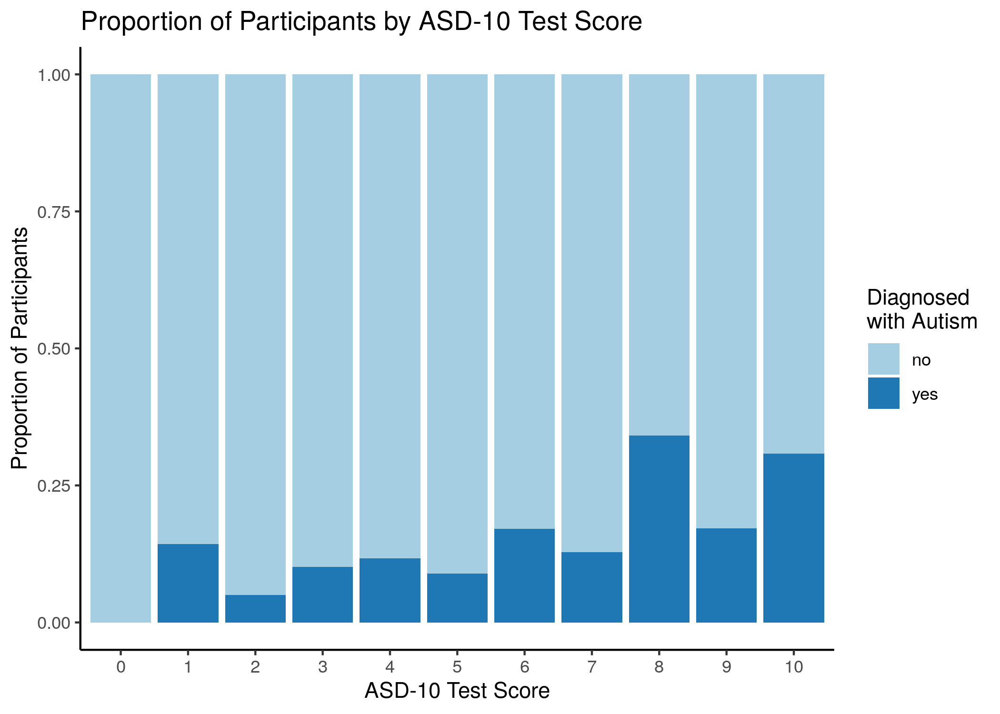

```{r setup, include=FALSE}
knitr::opts_chunk$set(echo = TRUE)
library(knitr)
library(tidyverse)
```

# Summary


Here we trained ____ models and discovered etc...


## Introduction


# Introduction

Autism Spectrum Disorder (ASD) is a complex neurodevelopmental condition that impairs social interpretation/communication ability, as well as the presence of repetitive behaviors. Current diagnostic procedures are lengthy and inefficient [@Fadi]. Affecting 1.5% of the population, with many more cases going undetected, an easy-to-implement, effective screening method is warranted. ASDTest, a mobile app, has been introduced to provide an accessible screening method that tells the user whether they should seek formal healthcare opinions, based on a 10 question survey [@allison2012toward]. The ability to recognize and diagnose ASD at an early age can allow the affected to access the healthcare resources and support they will need, in a timely manner. 

The Autism Spectrum Quotient-10<sup>3</sup> ([AQ-10](https://www.nice.org.uk/guidance/cg142/resources/autism-spectrum-quotient-aq10-test-pdf-186582493)) consists of 10 questions intended to differentiate characteristics of autism in individuals. Each question has four possible answers: "Definitely Agree", "Slightly Agree, "Slightly Disagree", and "Definitely Disagree". For questions 1, 5, 7, and 10, a value of 1 is assigned for either a "slightly agree" or a "definitely agree" response. For questions 2, 3, 4, 6, 8, and 9, a value of 1 is assigned for either a "slightly disagree" or a "definitely. disagree" response. A cumulative score is calculated for each individual, which is then used to recommend a healthcare opinion. An individual who receives a total score of greater than 6 is recommended for a specialist diagnostic assessment.

Using this metric, the ASD app has the following performance.

```{r plot 2, echo=FALSE, fig.cap="Figure 1. Confusion Matrix between the true ASD Diagnoses and the result of the ASD-10 results"}
knitr::include_graphics("../img/02_confusion_matrix.png")
```

Figure above depicts a confusion matrix of the true Diagnoses of ASD and the ASD-10 result. This confusion matrix will act as a baseline for how our model compares to the ASD-10 prediction.  The ASD-10 has high false positive rate of 110 cases which is an issue because it will push more participants to contact a healthcare professional and put more stress on the healthcare system as a whole. Additionally, the current ASD-10 has a manageable false negative rate of 33 cases which is a positive sign because as a screening test they do not want to miss out on potential patients.  

Currently, all 10 prompts have equal importance in the app's classification process. Our project aims to explore which survey questions are the most effective predictors. Could those be weighted more heavily in future ASD predictions? Additionally, are these survey questions more useful in our models, compared to an individual's background (age, gender, ethnicity)?


# Methods

## Data

The [dataset<sup>4</sup>](https://archive.ics.uci.edu/ml/datasets/Autism+Screening+Adult)  used in this analysis was obtained from the University of California Irvine Machine learning Repository<sup>5</sup>, uploaded by Fadi Thabtah. Each row represents an individual who participated in the survey. The survey's results, the app's classification, and some background information about the indvidual was recorded.

| Variable             | Type             | Description                                                                                                                            |
|----------------------|------------------|----------------------------------------------------------------------------------------------------------------------------------------|
| A1_score             | Int (0,1)        | Prompt: I often notice small sounds when others do not                                                                                 |
| A2_score             | Int (0,1)        | Prompt: I usually concentrate more on the whole picture, rather than the small details                                                 |
| A3_score             | Int (0,1)        | Prompt: I find it easy to do more than one thing at once                                                                               |
| A4_score             | Int (0,1)        | Prompt: If there is an interruption, I can switch back to what I was doing very quickly                                                |
| A5_score             | Int (0,1)        | Prompt: I find it easy to 'read between the lines' when someone is talking to me                                                       |
| A6_score             | Int (0,1)        | Prompt: I know how to tell if someone listening to me is getting bored                                                                 |
| A7_score             | Int (0,1)        | Prompt: When I'm reading a story I find it difficult to work out the characters' intentions                                            |
| A8_score             | Int (0,1)        | Prompt: I like to collect information about categories of things(e.g. types of car, types of bird, types of train, types of plant etc) |
| A9_score             | Int (0,1)        | Prompt: I find it easy to work out what someone is thinking or feeling just by looking at their face                                   |
| A10_score            | Int (0,1)        | Prompt: I find it difficult to work out people's intentions                                                                            |
| Age                  | Int              | Age of the individual                                                                                                                  |
| Gender               | String           | M (male) or F (female)                                                                                                                 |
| Ethnicity            | String           | Common Ethnicities defined for each individual                                                                                         |
| Born with Jaundice?  | String (yes,no)  | Was individual born with jaundice?                                                                                                     |
| Country of Residence | String           | Home country of individual                                                                                                             |
| Used app before?     | String (yes, no) | Has the user has used a screening app                                                                                                  |
| Result               | Int              | Cumulative score of the 10 survey Q's                                                                                                  |
| age_desc             | String           | Age Group                                                                                                                              |
| relation             | String           | Parent, self, caregiver, medical staff, clinician ,etc.                                                                                |
| ASD/Class            | String (yes, no) | App's classification based on result                                                                                                   |
| autism (Target Variable)  | String (yes, no) | Does individual have an autism diagnosis?  

## Analysis

The following ___ models were used. We dropped the following ___ variables before fitting our models. GridSearchCV was used to optimize parameters (maybe use the markdown variables to report any hyperparameters)

The following programming were used for this project: Python[@Python] and R[@R]. The following R packages were used: tidyverse[@tidyverse],knitr[@knitr], and reshape2. The following Python packages were used:docopt, zipfile, pandas, urllib, requests, sklearn, numpy, scipy.

#  Results & Discussion

1. Start with commenting about exploratory plots (insert Thomas' EDA plots)

To start, we explored the correlational relationships between the different AQ-10 survey questions.

```{r plot 1, echo=FALSE, fig.cap="Figure 2. Correlation heatmap of between questions on the ASD_10"}
knitr::include_graphics("../img/01_corr_heatmap.png")
```

In Figure 2, a maximum pearson correlation was 0.6, between AQ-4 and AQ-9. In general, very low correlational values were observed. Therefore, the ASD-10 test is a valid test with a low chance that a combination of question will swing the results. 

Next, we explored how the result, the cumulative score of the survey, related to autism diagnosis.

```{r plot 3, echo=FALSE, fig.cap="Figure 3. Proportion of true diagnosis and their final score on the ASD-10"}

```


The app was designed so that a result of six or greater resulted in a recommendation for a specialist opnion. Figure 3 depicts the proportion of true diagnosis and their score out of ten on the ASD-10. Results below or equal to 6 are associated with lower proportions of autism diagnosis, compared to the higher proportions associated with results greater than 6. Furthermore, if someone scored a zero then they didn’t have a true diagnosis of ASD which is an appropriate result for a screening test. The only issue is the 15% of people who scored one on their ASD-10 but had a true diagnose of ASD. Overall, the survey does show some effectiveness in classifying autism, but it isn't perfect. 

2. Talk about the results of ML (perhaps a table of performance, or another visual if we are feeling creative)

# Limitations/Assumptions

There were 131 rows that contained "?" or "other" values in the "country_of_res", "relation", and "age" columns. It is possible that "?" values resulted in participants not filling aspects of the survey. We were unable to easily fill these values without feeling like we would bias our results. Instead, we opted to remove these rows entirely and only use the remaining data. This limits our study because we did lose (18%) of the original data that could had a potential influence on our model.  

Our original intention was to use survey data from children, adolescents, and adults. However, we were unable to access the survey questions used for the Child-AQ-10 and Adolescent-AQ-10, which are different to the Adult-AQ-10 question. As a result, we were limited to addressing questions that focused on solely on adults.


# References
