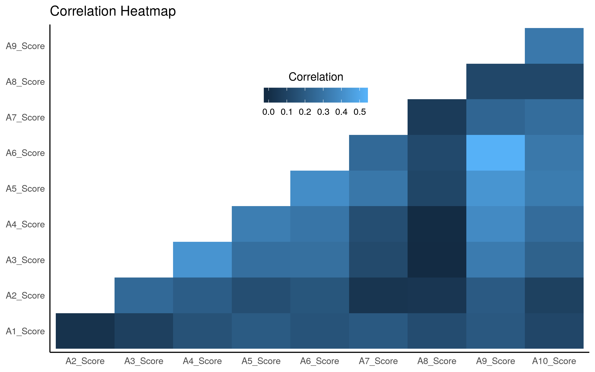

```{r setup, include=FALSE}
knitr::opts_chunk$set(echo = TRUE)
library(knitr)
library(tidyverse)
library(caret)
```

# Summary


## Introduction

Autism Spectrum Disorder (ASD) is a complex neurodevelopmental condition that impairs social interpretation/communication ability, as well as the presence of repetitive behaviors. Current diagnostic procedures are lengthy and inefficient [@Fadi]. Affecting 1.5% of the population, with many more cases going undetected, an easy-to-implement, effective screening method is warranted. ASDTest, a mobile app, has been introduced to provide an accessible screening method that tells the user whether they should seek formal healthcare opinions, based on a 10 question survey [@pmid22265366]. The ability to recognize and diagnose ASD at an early age can allow the affected to access the healthcare resources and support they will need, in a timely manner. 

The Autism Spectrum Quotient-10<sup>3</sup> (AQ-10) consists of 10 questions intended to differentiate characteristics of autism in individuals. Each question has four possible answers: "Definitely Agree", "Slightly Agree, "Slightly Disagree", and "Definitely Disagree". For questions 1, 5, 7, and 10, a value of 1 is assigned for either a "slightly agree" or a "definitely agree" response. For questions 2, 3, 4, 6, 8, and 9, a value of 1 is assigned for either a "slightly disagree" or a "definitely. disagree" response. A cumulative score is calculated for each individual, which is then used to recommend a healthcare opinion. An individual who receives a total score of greater than 6 is recommended for a specialist diagnostic assessment.

Surveys are useful screening tools, but there is always a concern that they can often be answered in a subjective manner. Therefore, we sought to understand how effective are these surveys in predicting an autism diagnosis, and which survey questions are the most effective predictors. Additionally, are these survey questions more useful in our models, compared to an individual's background (age, gender, ethnicity)?

# Methods
# Results & Discussion

# Limitations

- could not get access directly to AQ-10 surveys for children and adolescents. We made an assumption that they follow the same metric as the adult AQ-10.
- Implications of removing the ?/others rows.

# References


```{r plot 1, echo=FALSE, fig.cap="Figure 1. Correlation heatmap of between questions on the ASD_10"}

```

Figure above depicts the correlation between questions on ASD-10. None of the questions have a high correlation between each other and highest correlation is .6. Therefore, the ASD-10 test is a valid test with a low chance that a combination of question will swing the results.


```{r plot 2, echo=FALSE, fig.cap="Figure 2. Confusion Matrix between the true ASD Diagnoses and the result of the ASD-10 results"}
knitr::include_graphics("../img/02_confusion_matrix.png")
```

Figure above depicts a confusion matrix of the true Diagnoses of ASD and the ASD-10 result. This confusion matrix will act as a baseline for how our model compares to the ASD-10 prediction.  The ASD-10 has high false positive rate of 110 cases which is an issue because it will push more participants to contact a healthcare professional and put more stress on the healthcare system as a whole. Additionally, the current ASD-10 has a manageable false negative rate of 33 cases which is a positive sign because as a screening test they do not want to miss out on potential patients.  


```{r plot 3, echo=FALSE, fig.cap="Figure 3. Proportion of true diagnosis and their final score on the ASD-10"}
knitr::include_graphics("../img/03_prop_result.png")
```

Figure above depicts the proportion of true diagnosis and their score out of ten on the ASD-10. Currently, as their score is above six, which is the threshold for the ASD-10 diagnoses, the proportion of true diagnosis is increasing. Furthermore,  if someone scored a zero then they didn’t have a true diagnosis of ASD which is an appropriate result for a screening test. The only issue is the 15% of people who scored one on their ASD-10 but had a true diagnose of ASD.  