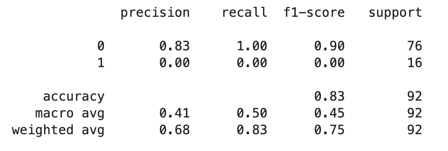

Autism Spectrum Disorder Screening Machine Learning Analysis
================
Matthew Connell, Thomas Pin and Tejas Phaterpekar
22/01/2020

# Summary

Here we trained several machine learning models from the `sklearn`
package in the Python programming language in attempt to find a model
that would better and more quickly diagnose autism in adults. We used
survey data from the [UCI Machine Learning
Datasets](https://archive.ics.uci.edu/ml/datasets/Autism+Screening+Adult)
repository.

The survey data we used consisted of ten questions in addition to other
information about the respondent, such as age and country of residence.
We looked into whether there were questions that could be disregarded
from the survey without having a negative impact on the accuracy of
diagnosis.

We eventually chose a Decision Tree Classifier as our model. However,
even though we had decent results on training and validation data, our
model was poor at predicting outcomes on our test data.

# Introduction

Autism Spectrum Disorder (ASD) is a complex neurodevelopmental condition
that impairs social interpretation/communication ability, as well as the
presence of repetitive behaviors. Current diagnostic procedures are
lengthy and inefficient (Thabtah 2019). Affecting 1.5% of the
population, with many more cases going undetected, an easy-to-implement,
effective screening method is warranted. ASDTest, a mobile app, has been
introduced to provide an accessible screening method that tells the user
whether they should seek professional healthcare opinions, based on a 10
question survey (Allison, Auyeung, and Baron-Cohen 2012). The ability to
recognize and diagnose ASD at an early age can allow the affected to
access the healthcare resources and support they will need, in a timely
manner.

The Autism Spectrum Quotient-10
([AQ-10](https://www.nice.org.uk/guidance/cg142/resources/autism-spectrum-quotient-aq10-test-pdf-186582493))
consists of 10 questions intended to differentiate characteristics of
autism in individuals. Each question has four possible answers:
“Definitely Agree”, “Slightly Agree,”Slightly Disagree“,
and”Definitely Disagree“. For questions 1, 5, 7, and 10, a value of 1
is assigned for either a”slightly agree" or a “definitely agree”
response. For questions 2, 3, 4, 6, 8, and 9, a value of 1 is assigned
for either a “slightly disagree” or a “definitely. disagree” response. A
cumulative score is calculated and a participant who receives a total
score of greater than 6 is recommendeded for a specialist diagnostic
assessment.

Using this metric on the dataset, the ASDTest app has the following
performance.

Figure 1. Confusion Matrix between the true ASD Diagnoses and the result
of the ASD-10 results

The confusion matrix in Figure 1 will act as a baseline for how our
model compares to the AQ-10 predictions. The AQ-10 has high false
positive rate of 110 cases which is an issue because it will push more
participants to contact a healthcare professional and put more stress on
the healthcare system as a whole. Additionally, the current ASD-10 has a
high recall (0.895) with only 33 false negative cases. This is a
positive sign because as a screening test they do not want to miss out
on potential patients.

Currently, all 10 prompts have equal importance in the app’s
classification process. Our project aims to explore which survey
questions are the most effective predictors. Could those be weighted
more heavily in future ASD predictions? Additionally, are these survey
questions more useful in our models, compared to an individual’s
background (age, gender, ethnicity)?

# Methods

## Data

The
[dataset4](https://archive.ics.uci.edu/ml/datasets/Autism+Screening+Adult)
used in this analysis was obtained from the University of California
Irvine Machine learning Repository, uploaded by Fadi Thabtah. Each row
represents an individual who participated in the survey. The survey’s
results, the app’s classification, and some background information about
the indvidual was recorded. Below is the entire variable
set:

<table class="table table-condensed" style="width: auto !important; margin-left: auto; margin-right: auto;">

<thead>

<tr>

<th style="text-align:left;position: sticky; top:0; background-color: #FFFFFF;">

Variable

</th>

<th style="text-align:left;position: sticky; top:0; background-color: #FFFFFF;">

Type

</th>

<th style="text-align:left;position: sticky; top:0; background-color: #FFFFFF;">

Description

</th>

</tr>

</thead>

<tbody>

<tr>

<td style="text-align:left;">

A1\_score

</td>

<td style="text-align:left;">

Int (0,1)

</td>

<td style="text-align:left;">

Prompt: I often notice small sounds when others do not

</td>

</tr>

<tr>

<td style="text-align:left;">

A2\_score

</td>

<td style="text-align:left;">

Int (0,1)

</td>

<td style="text-align:left;">

Prompt: I usually concentrate more on the whole picture, rather than the
small details

</td>

</tr>

<tr>

<td style="text-align:left;">

A3\_score

</td>

<td style="text-align:left;">

Int (0,1)

</td>

<td style="text-align:left;">

Prompt: I find it easy to do more than one thing at once

</td>

</tr>

<tr>

<td style="text-align:left;">

A4\_score

</td>

<td style="text-align:left;">

Int (0,1)

</td>

<td style="text-align:left;">

Prompt: If there is an interruption, I can switch back to what I was
doing very quickly

</td>

</tr>

<tr>

<td style="text-align:left;">

A5\_score

</td>

<td style="text-align:left;">

Int (0,1)

</td>

<td style="text-align:left;">

Prompt: I find it easy to ‘read between the lines’ when someone is
talking to me

</td>

</tr>

<tr>

<td style="text-align:left;">

A6\_score

</td>

<td style="text-align:left;">

Int (0,1)

</td>

<td style="text-align:left;">

Prompt: I know how to tell if someone listening to me is getting bored

</td>

</tr>

<tr>

<td style="text-align:left;">

A7\_score

</td>

<td style="text-align:left;">

Int (0,1)

</td>

<td style="text-align:left;">

Prompt: When I’m reading a story I find it difficult to work out the
characters’ intentions

</td>

</tr>

<tr>

<td style="text-align:left;">

A8\_score

</td>

<td style="text-align:left;">

Int (0,1)

</td>

<td style="text-align:left;">

Prompt: I like to collect information about categories of
things(e.g. types of car, types of bird, types of train, types of plant
etc)

</td>

</tr>

<tr>

<td style="text-align:left;">

A9\_score

</td>

<td style="text-align:left;">

Int (0,1)

</td>

<td style="text-align:left;">

Prompt: I find it easy to work out what someone is thinking or feeling
just by looking at their face

</td>

</tr>

<tr>

<td style="text-align:left;">

A10\_score

</td>

<td style="text-align:left;">

Int (0,1)

</td>

<td style="text-align:left;">

Prompt: I find it difficult to work out people’s intentions

</td>

</tr>

<tr>

<td style="text-align:left;">

Age

</td>

<td style="text-align:left;">

Int

</td>

<td style="text-align:left;">

Age of the individual

</td>

</tr>

<tr>

<td style="text-align:left;">

Gender

</td>

<td style="text-align:left;">

String

</td>

<td style="text-align:left;">

M (male) or F (female)

</td>

</tr>

<tr>

<td style="text-align:left;">

Ethnicity

</td>

<td style="text-align:left;">

String

</td>

<td style="text-align:left;">

Common Ethnicities defined for each individual

</td>

</tr>

<tr>

<td style="text-align:left;">

Born with Jaundice?

</td>

<td style="text-align:left;">

String (yes,no)

</td>

<td style="text-align:left;">

Was individual born with jaundice?

</td>

</tr>

<tr>

<td style="text-align:left;">

Country of Residence

</td>

<td style="text-align:left;">

String

</td>

<td style="text-align:left;">

Home country of individual

</td>

</tr>

<tr>

<td style="text-align:left;">

Used app before?

</td>

<td style="text-align:left;">

String (yes, no)

</td>

<td style="text-align:left;">

Has the user has used a screening app

</td>

</tr>

<tr>

<td style="text-align:left;">

Result

</td>

<td style="text-align:left;">

Int

</td>

<td style="text-align:left;">

Cumulative score of the 10 survey Q’s

</td>

</tr>

<tr>

<td style="text-align:left;">

age\_desc

</td>

<td style="text-align:left;">

String

</td>

<td style="text-align:left;">

Age Group

</td>

</tr>

<tr>

<td style="text-align:left;">

relation

</td>

<td style="text-align:left;">

String

</td>

<td style="text-align:left;">

Parent, self, caregiver, medical staff, clinician ,etc.

</td>

</tr>

<tr>

<td style="text-align:left;">

ASD/Class

</td>

<td style="text-align:left;">

String (yes, no)

</td>

<td style="text-align:left;">

App’s classification based on result

</td>

</tr>

<tr>

<td style="text-align:left;">

autism (Target Variable)

</td>

<td style="text-align:left;">

String (yes, no)

</td>

<td style="text-align:left;">

Does individual have an autism diagnosis?

</td>

</tr>

</tbody>

</table>

## Analysis

To start, we explored the correlational relationships between the
different AQ-10 survey
questions.

Figure 2. Correlation heatmap of between questions on the ASD\_10

In Figure 2, a maximum pearson correlation was 0.6, between AQ-4 and
AQ-9. In general, very low correlational values were observed.
Therefore, the ASD-10 test is a valid test with a low chance that a
combination of question will swing the results.

Next, we explored how the cumulative score of the survey(`result`)
related to an autism
diagnosis.

Figure 3. Proportion of true diagnosis and their final score on the
ASD-10

The app was designed so that a result of six or greater resulted in a
recommendation for a specialist opnion. Figure 3 depicts the proportion
of true diagnosis and their score out of ten on the ASD-10. Results
below or equal to 6 were associated with lower proportions of autism
diagnosis, compared to the higher proportions associated with results
greater than 6. Furthermore, if someone scored a zero then they didn’t
have a true diagnosis of ASD which is an appropriate result for a
screening test. The only issue is the 15% of people who scored one on
their ASD-10 but had a true diagnose of ASD. Overall, these observations
show that the survey does show some effectiveness in classifying autism,
although this classfication isn’t flawless.

### Choosing a model

For the analysis, the training data was split into a train set and a
validation set. Using these sets of data, we conducted a grid search
with cross validation over five different type of models (Logistic
Regression, K-Nearest Neighbors, Random Forest Classifier, Decision Tree
Classifier, and Support Vector Machine classification). We used `recall`
as the scoring method as our goal was not to get the most accurate
model, but to get the model that reduced the number of false negatives.
Additionally, there was the issue of class imbalance as our dataset
consisted mostly of people who were not diagnosed with Autism. Merely
choosing accuracy as our goal would have made the model predict only
negative outcomes.

The model with the best recall was found to be a `Decision Tree
Classifier` with parameters `max_depth` equal to 20 and `max_features`
equal to 50. The classification report on the validation set for this
model is below. The recall score is
0.38.

Figure 4. Classification Report for a Decision Tree Classifier

### Improving the model

One of the goals of this project was to find which questions on the
survey would best predict the diagnosis of Autism and whether or not any
of the questions from the survey could be dropped without reducing
accuracy. This would help streamline the diagnosis process and save time
for everyone.

#### Forward Selection

An attempt at choosing the best questions was made using the feature
selection concept of `forward selection`, where a model chooses the
feature that best predicts the validation set, and then the next best
feature is chosen. However, it was determined that no one question was
better than another at predicting the outcomes, so `forward selection`
was not useful.

#### Recursive Feature Elimination

We tried another method of feature selection called `recursive feature
elimination`, which looks at all features and then eliminates the one
that is the least helpful in predicting the target features. This is
done until the desired number of features is selected.

The ‘best’ questions found by `RFE` were questions 4, 5, 6, 8, and 10.

However, when fitting a new `Decision Tree Classifier` with only these
features, the recall score got worse on both the training set and the
validation set. See the classification report for the top five questions
below:

Figure 5. Classification Report for a Decision Tree Classifier, using
top 5 questions

Similarly, choosing all the questions as features and no other features
yielded worse results than our initial
model.

Figure 6. Classification Report for a Decision Tree Classifier, using
all 10 questions

# Final Results/Discussion

After selecting a model with grid search cross-validation and deciding
to use all the features of the dataset, we used our Decision Tree model
to predict results on our test set. Unfortunately, the recall score was
far below that of our validation set.

Classification report of final model on test
set:

Figure 7. Classification Report for a Decision Tree Classifier, using
all features

A recall score of 0.07 is worse than we were expecting.

ROC
curve:

Figure 8. Decision Tree Classifier ROC Curve

In future research, we should look into increasing the sensitivity of
the model against false negatives, contact domain experts for assistance
in feature engineering, and delve deeper into hyperparameter
optimization.

# Limitations/Assumptions

There were 131 rows that contained “?” or “other” values in the
“country\_of\_res”, “relation”, and “age” columns. It is possible that
“?” values resulted in participants not filling aspects of the survey.
We were unable to easily fill these values without feeling like we would
bias our results. Instead, we opted to remove these rows entirely and
only use the remaining data. This limits our study because we did lose
(18%) of the original data that could had a potential influence on our
model.

Our original intention was to use survey data from children,
adolescents, and adults. However, we were unable to access the survey
questions used for the Child-AQ-10 and Adolescent-AQ-10, which are
different to the Adult-AQ-10 question. As a result, we were limited to
addressing questions that focused on solely on adults.

# Code Attributions

The following programming languages were used for this project: Python
(Van Rossum and Drake 2009) and R (R Core Team 2019). The following R
packages were used: tidyverse (Wickham 2017), knitr (Xie 2014), reshape2
(Wickham 2007), docopt (de Jonge 2018), caret (Kuhn 2009), testthat
(Wickham 2011) and kableExtra (Zhu 2019). The following Python packages
were used:docopt(Keleshev 2014), zipfile (Van Rossum and Drake 2009),
pandas (McKinney 2010), urllib (Van Rossum and Drake 2009), requests
(Chandra and Varanasi 2015), sklearn (Pedregosa et al. 2011), numpy
(Oliphant, n.d.), scipy (Virtanen et al. 2019), and altair (VanderPlas
et al. 2018).

# References

Allison, Carrie, Bonnie Auyeung, and Simon Baron-Cohen. 2012. “Toward
Brief ‘Red Flags’ for Autism Screening: The Short Autism Spectrum
Quotient and the Short Quantitative Checklist in 1,000 Cases and 3,000
Controls.” *Journal of the American Academy of Child & Adolescent
Psychiatry* 51 (2). Elsevier: 202–12.

Chandra, Rakesh Vidya, and Bala Subrahmanyam Varanasi. 2015. *Python
Requests Essentials*. Packt Publishing.

de Jonge, Edwin. 2018. *Docopt: Command-Line Interface Specification
Language*. <https://CRAN.R-project.org/package=docopt>.

Keleshev, Vladimir. 2014. *Docopt: Command-Line Interface Description
Language*. <https://github.com/docopt/docopt>.

Kuhn, Max. 2009. “The Caret Package.”

McKinney, Wes. 2010. “Data Structures for Statistical Computing in
Python.” In *Proceedings of the 9th Python in Science Conference*,
edited by Stéfan van der Walt and Jarrod Millman, 51–56.

Oliphant, Travis. n.d. “NumPy: A Guide to NumPy.” USA: Trelgol
Publishing. <http://www.numpy.org/>.

Pedregosa, F., G. Varoquaux, A. Gramfort, V. Michel, B. Thirion, O.
Grisel, M. Blondel, et al. 2011. “Scikit-Learn: Machine Learning in
Python.” *Journal of Machine Learning Research* 12: 2825–30.

R Core Team. 2019. *R: A Language and Environment for Statistical
Computing*. Vienna, Austria: R Foundation for Statistical Computing.
<https://www.R-project.org/>.

Thabtah, Fadi. 2019. “An Accessible and Efficient Autism Screening
Method for Behavioural Data and Predictive Analyses.” *Health
Informatics Journal* 25 (4): 1739–55.
<https://doi.org/10.1177/1460458218796636>.

VanderPlas, Jacob, Brian Granger, Jeffrey Heer, Dominik Moritz, Kanit
Wongsuphasawat, Eitan Lees, Ilia Timofeev, Ben Welsh, and Scott Sievert.
2018. “Altair: Interactive Statistical Visualizations for Python.”
*Journal of Open Source Software*, December. The Open Journal.
<https://doi.org/10.21105/joss.01057>.

Van Rossum, Guido, and Fred L. Drake. 2009. *Python 3 Reference Manual*.
Scotts Valley, CA: CreateSpace.

Virtanen, Pauli, Ralf Gommers, Travis E. Oliphant, Matt Haberland, Tyler
Reddy, David Cournapeau, Evgeni Burovski, et al. 2019. “SciPy
1.0–Fundamental Algorithms for Scientific Computing in Python.” *arXiv
E-Prints*, July, arXiv:1907.10121.

Wickham, Hadley. 2007. “Reshaping Data with the reshape Package.”
*Journal of Statistical Software* 21 (12): 1–20.
<http://www.jstatsoft.org/v21/i12/>.

———. 2011. “Testthat: Get Started with Testing.” *The R Journal* 3:
5–10.
<https://journal.r-project.org/archive/2011-1/RJournal_2011-1_Wickham.pdf>.

———. 2017. *Tidyverse: Easily Install and Load the ’Tidyverse’*.
<https://CRAN.R-project.org/package=tidyverse>.

Xie, Yihui. 2014. “Knitr: A Comprehensive Tool for Reproducible Research
in R.” In *Implementing Reproducible Computational Research*, edited by
Victoria Stodden, Friedrich Leisch, and Roger D. Peng. Chapman;
Hall/CRC. <http://www.crcpress.com/product/isbn/9781466561595>.

Zhu, Hao. 2019. *KableExtra: Construct Complex Table with ’Kable’ and
Pipe Syntax*. <https://CRAN.R-project.org/package=kableExtra>.

